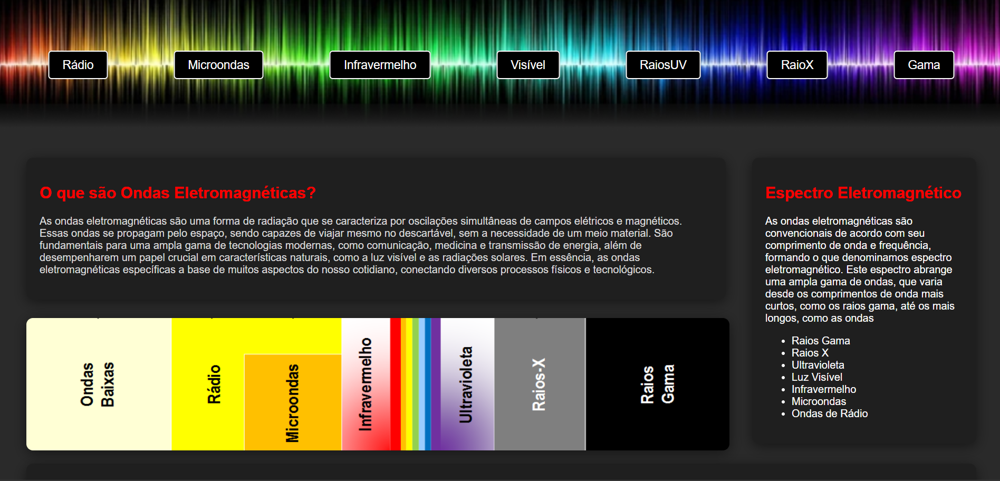

# 🌐 Projeto: Ondas Eletromagnéticas


---

## 📖 Sobre o projeto
Site educativo sobre **ondas eletromagnéticas**, explicando o espectro (rádio, micro-ondas, infravermelho, luz visível, ultravioleta, raios X e gama), suas aplicações no cotidiano e curiosidades, de forma clara, interativa e visual.

---

## 📷 Prévia
Aqui está uma prévia do site:  



> 💡 Se quiser, substitua `./images/tabela.png` por outra imagem ou print atualizado do seu site.

---

## 🚀 Como executar
1. Clone este repositório:
   ```bash
   git clone https://github.com/seu-usuario/seu-repo.git
